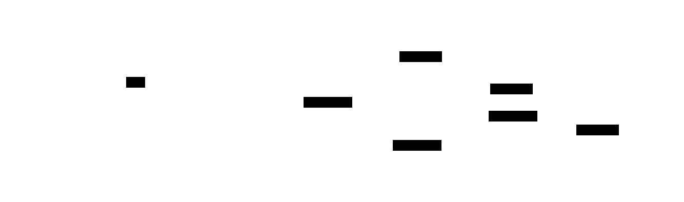
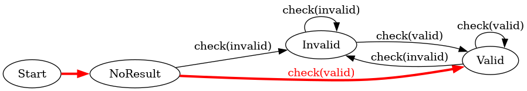
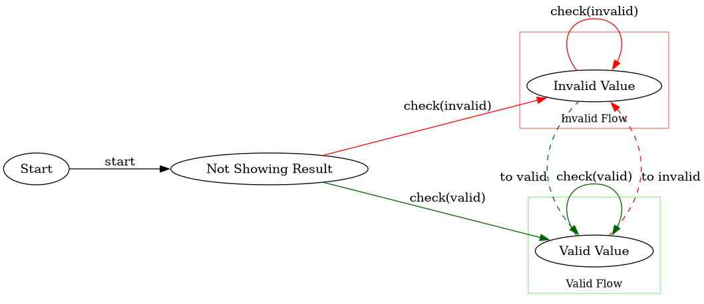
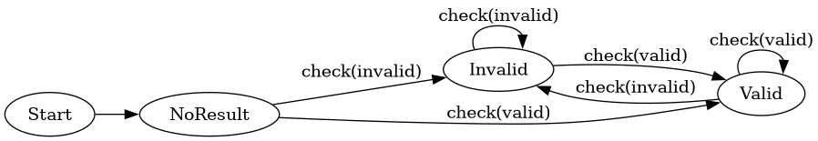
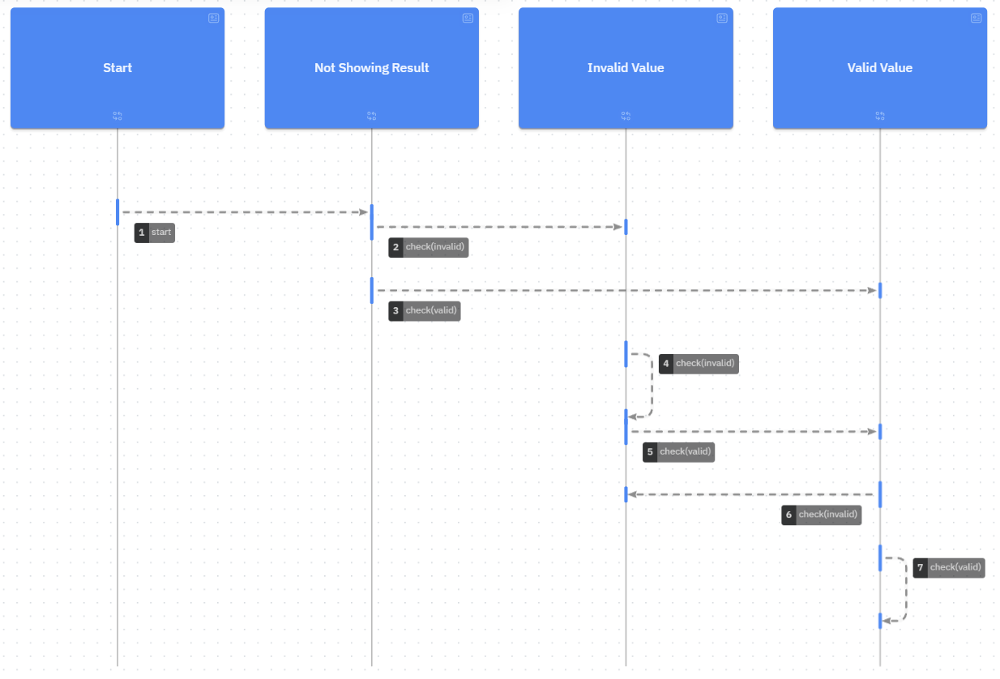
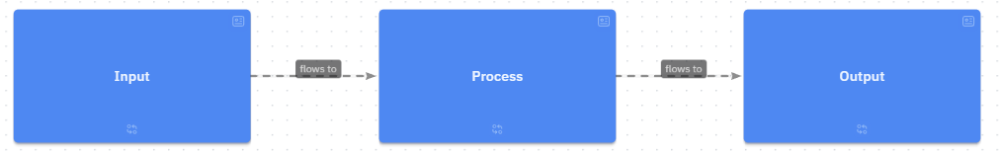
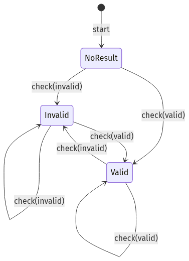
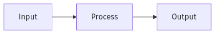
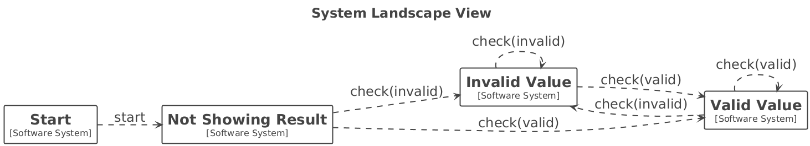
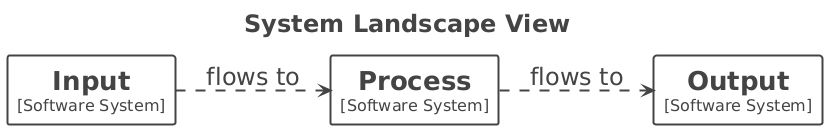

# Diagram Examples

This folder contains diagram source files and generated image outputs for the 7charval examples.

## D2

### 7charval state transitions

Shows the high-level state flow from start to valid/invalid outcomes.

Source: [d2/d2-7charval.d2](d2/d2-7charval.d2)

### Input -> Process -> Output

A minimal flow showing the basic processing pipeline.

Source: [d2/d2-input-process-output.d2](d2/d2-input-process-output.d2)

## Graphviz

### Coverage path from start to valid/no-result

Illustrates a coverage-oriented path through start, no-result, and validation outcomes.

Source: [graphviz/7charval-coverage-path-start-noresult-valid.dot](graphviz/7charval-coverage-path-start-noresult-valid.dot)

### Clustered testing view

Groups related states and transitions into clusters for easier reasoning.

Source: [graphviz/7charval-testing-example-clusters.dot](graphviz/7charval-testing-example-clusters.dot)

### Basic testing example

A straightforward graph showing key validation transitions.

Source: [graphviz/7charval-testing-example.dot](graphviz/7charval-testing-example.dot)

## LikeC4

The LikeC4 examples are not supported by the plantumlc4 endpoint in Kroki.

### 7charval LikeC4 model

A LikeC4-style model view of the 7charval states and interactions.

Source: [likec4/likec4-7charval.c4](likec4/likec4-7charval.c4)

### Input/process/output LikeC4 model

A LikeC4 diagram representing a simple input-to-output flow.

Source: [likec4/likec4-input-process-output.c4](likec4/likec4-input-process-output.c4)

## Mermaid

### 7charval state diagram

State-oriented Mermaid diagram for valid/invalid/no-result transitions.

Source: [mermaid/mermaid-7charval-state.mmd](mermaid/mermaid-7charval-state.mmd)

### Input -> Process -> Output

A minimal Mermaid flow for data passing through process to output.

Source: [mermaid/mermaid-input-process-output.mmd](mermaid/mermaid-input-process-output.mmd)

## Structurizr DSL

### 7charval structurizr model

System-level structurizr view of the major states and relationships.

Source: [structurizr/structurizr-7charval.dsl](structurizr/structurizr-7charval.dsl)

### Input/process/output structurizr model

A compact structurizr DSL example of the input/process/output relationship.

Source: [structurizr/structurizr-input-process-output.dsl](structurizr/structurizr-input-process-output.dsl)

