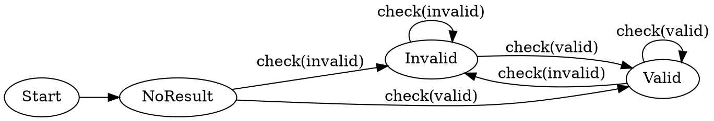

# Graphviz Examples

This folder contains Graphviz `.dot` sources and generated `.png` images.

## Inline Graphviz source example

This is the source from `7charval-testing-example.dot`.

## Generated images

### Coverage path from start to valid/no-result

Source: [7charval-coverage-path-start-noresult-valid.dot](7charval-coverage-path-start-noresult-valid.dot)

### Clustered testing view

Source: [7charval-testing-example-clusters.dot](7charval-testing-example-clusters.dot)

### Basic testing example

Source: [7charval-testing-example.dot](7charval-testing-example.dot)

